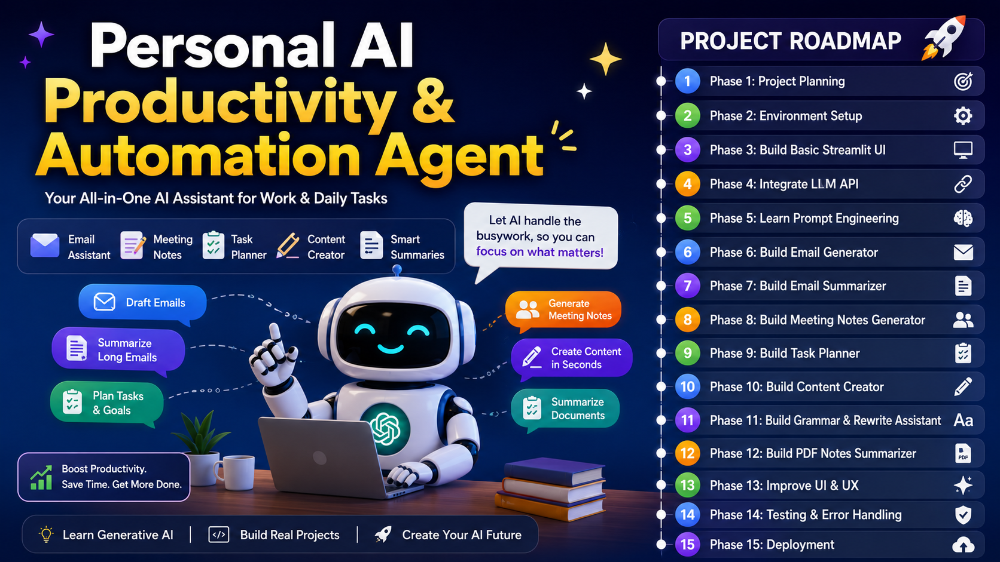

# Personal AI Productivity & Automation Agent

A modular AI-powered productivity platform built using Python, Streamlit, and the Groq API. The application streamlines everyday productivity tasks such as email writing, meeting note generation, content creation, task planning, grammar correction, and PDF summarization through a clean multi-page interface.

---

<p align="center">
  
</p>

---

## Table of Contents

- Overview
- Features
- System Architecture
- Technology Stack
- Project Structure
- Installation
- Configuration
- Running the Application
- Screenshots
- Future Enhancements
- Challenges & Learnings
- Developer
- License

---

## Overview

The Personal AI Productivity & Automation Agent is designed to simplify repetitive productivity tasks using Large Language Models (LLMs). The project follows a modular architecture that separates configuration, business logic, utilities, and user interface components, making it scalable and easy to maintain.

---

## Features

- AI Email Generator
- Email Summarizer
- Meeting Notes Generator
- Task Planner
- AI Content Creator
- Grammar & Text Rewriter
- PDF Summarizer
- Settings Management
- Multi-page Streamlit Application
- Groq API Integration
- Responsive User Interface

---

## System Architecture

```
                User
                  │
                  ▼
          Streamlit Frontend
                  │
                  ▼
          Service Layer
                  │
                  ▼
           LLM Service
                  │
                  ▼
             Groq API
```

---

## Technology Stack

| Category | Technology |
|-----------|------------|
| Language | Python |
| Framework | Streamlit |
| AI Provider | Groq |
| Language Model | Llama 3 |
| Data Processing | Pandas |
| PDF Processing | PyPDF |
| Environment Variables | python-dotenv |
| Version Control | Git & GitHub |

---

## Project Structure

```text
Personal_AI_Productivity_Chatbot/
│
├── assets/
├── config/
├── llm/
├── pages/
├── services/
├── utils/
│
├── app.py
├── requirements.txt
├── README.md
└── .gitignore
```

---

## Installation

### Clone the Repository

```bash
git clone https://github.com/Pravallikasurya/Personal_AI_Productivity_Chatbot.git
```

### Navigate to the Project

```bash
cd Personal_AI_Productivity_Chatbot
```

### Create a Virtual Environment

```bash
python -m venv venv
```

### Activate the Virtual Environment

Windows

```bash
venv\Scripts\activate
```

macOS/Linux

```bash
source venv/bin/activate
```

### Install Dependencies

```bash
pip install -r requirements.txt
```

---

## Configuration

Create a `.env` file in the project root.

```env
GROQ_API_KEY=your_groq_api_key
```

> Never commit your `.env` file or API keys to GitHub.

---

## Running the Application

```bash
streamlit run app.py
```

Open your browser:

```
http://localhost:8501
```

---

## Screenshots

<p align="center">
    
</p>

### Home Dashboard

_Add screenshot here_

### Email Generator

_Add screenshot here_

### Task Planner

_Add screenshot here_

### PDF Summarizer

_Add screenshot here_

---

## Key Learning Outcomes

This project helped strengthen practical knowledge in:

- Python Application Development
- Streamlit Multi-page Applications
- Prompt Engineering
- REST API Integration
- Large Language Model Integration
- Modular Software Architecture
- Environment Variable Management
- Git & GitHub Workflow

---

## Future Enhancements

- User Authentication
- Conversation History
- Multiple LLM Support
- Voice Commands
- Cloud Deployment
- Database Integration
- Export to PDF and DOCX
- Dark Mode
- AI Analytics Dashboard

---

## Challenges Faced

During the development of this project, several practical software engineering challenges were encountered and resolved, including:

- Organizing a scalable project structure
- Managing virtual environments
- Git and GitHub repository restructuring
- Protecting API keys using environment variables
- Designing a responsive Streamlit user interface
- Integrating the Groq API with modular service components

---

## Developer

**Pravallika Surya**

Bachelor of Technology (Information Technology)

Interested in Artificial Intelligence, Python Development, Software Engineering, and Intelligent Automation.

GitHub:
https://github.com/Pravallikasurya

---

## License

This project is intended for educational, learning, and portfolio purposes.
